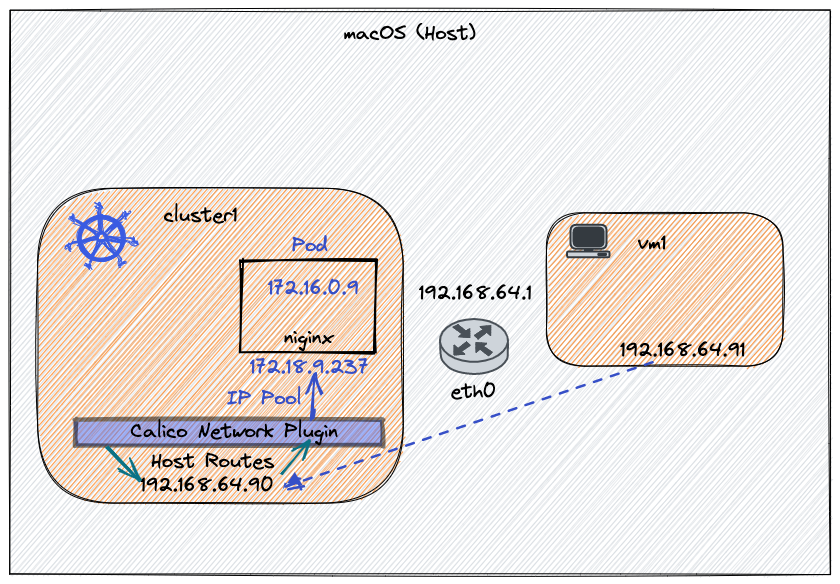

# Letting VMs talk to Kubernetes

A demo to show how to communicate with Kubernetes Services and Pods using their Cluster-IP or Pod-IP from another machine e.g. a VM.

## Tools

- [direnv](https://direnv.net)
- [multipass](https://multipass.run/)
- [kubectl](https://kubernetes.io/docs/tasks/tools/)
- [calico](https://projectcalico.docs.tigera.io/)
- [jq](https://stedolan.github.io/jq/)

## Download Sources

```shell
  git clone https://github.com/kameshsampath/vm-to-kubernetes-demo
  cd vm-to-kubernetes-demo
```

## Demo Architecture



## Ensure Environment

```shell
export DEMO_HOME="${PWD}"
export KUBECONFIG_DIR="${PWD}/.kube"
export KUBECONFIG="${KUBECONFIG_DIR}/config"
```

## Kubernetes Cluster

### Settings

The k3s cluster will be a single node cluster run via multipass VM. We will configure that to with the following flags,

- `--cluster-cidr=172.16.0.0/24` allows us to create 65 – 110 Pods on this node
- `--service-cidr=172.18.0.0/20` allows us to create 4096 services
- `--disable=traefik` disable `traefik` deployment

For more information on how to calculate the number of pods and service per CIDR rang, check the [GKE doc](https://cloud.google.com/kubernetes-engine/docs/concepts/alias-ips).

### Create Kubernetes Cluster

The following command will create kubernetes(k3s) cluster and configure it with no network plugin. Check the [k3s with Calico](./configs/k3s-cni-calico)

```shell
multipass launch \
  --name cluster1 \
  --cpus 4 --mem 8g --disk 20g \
  --cloud-init $DEMO_HOME/configs/k3s-cni-calico
```

Retrieve and save the `kubeconfig` and save it locally to allow the access to the cluster from the host,

```shell
mkdir -p "$KUBECONFIG_DIR"
chmod -R 644 "$KUBECONFIG_DIR"
export CLUSTER1_IP=$(multipass info cluster1 --format json  | jq -r '.info.cluster1.ipv4[0]')
# Copy kubeconfig
multipass exec cluster1 sudo cat /etc/rancher/k3s/k3s.yaml > "$KUBECONFIG_DIR/config"
# use the CLUSTER1_IP over localhost/127.0.0.1
sed -i -E "s|127.0.0.1|${CLUSTER1_IP}|" "$KUBECONFIG_DIR/config"
# for better clarity as default name is `default` 
sed -i -E "s|(^.*:\s*)(default)|\1cluster1|g" "$KUBECONFIG_DIR/config"
```

### Deploy Calico Network Plugin

Let us deploy [Calico](https://projectcalico.docs.tigera.io) plugin. The steps are based on the [Quickstart](https://projectcalico.docs.tigera.io/getting-started/kubernetes/k3s/quickstart) except we make few changes to the custom resources.

Deploy the operator,

```shell
kubectl create -f https://docs.projectcalico.org/manifests/tigera-operator.yaml
```

Wait for the operator to be running,

```shell
kubectl rollout status -n tigera-operator deploy/tigera-operator --timeout=180s
```

Let us now deploy the Calico custom resource with ipPool as `172.16.0.0/24`, this will allow us to run max of `110` pods. We also make sure we enable ipforwarding in calico container settings.

```shell
kubectl create -f $DEMO_HOME/manifests/calico-cr.yaml
```

Watch for all pods in all namespaces to be running ( changed from pending to running),

```shell
watch kubectl get pods -A 
```

Deploy a simple nignx service to test the connectivity from the VM,

```shell
kubectl --context=cluster1 run nginx --image=nginx --expose --port 80 --dry-run=client -o yaml | k --context=cluster1  apply  -f -
```

### Virtual Machine

```shell
multipass launch --name vm1 \
  --cpus 2 --mem 4g --disk 20g \
  --cloud-init $DEMO_HOME/configs/workload-vm
```

Lets mount the local `.kube` directory inside the vm

```shell
multipass transfer "$KUBECONFIG" vm1:/home/ubuntu/.kube/config
```

Shell into the vm,

```shell
multipass exec vm1 bash
```

### Add routes on VMs

```shell
sudo ip route add 172.16.0.0/28 via $CLUSTER1_IP
sudo ip route add 172.18.0.0/20 via $CLUSTER1_IP
```

`CLUSTER1_IP` - is the VM where the k3s cluster is running

Note down the `service IP(Cluster-IP)` of the nginx pod,

```shell
export NGINX_SVC_IP=$(kubectl get svc nginx -ojsonpath='{.spec.clusterIP}')
```

Note down the `POD IP` of the nginx pod,

```shell
export NGINX_POD_IP=$(kubectl get pod nginx -ojsonpath='{.status.podIP}')
```

Now you can check the connectivity to service ip using curl,

```shell
curl -s -I --connect-timeout 3 --max-time 5  $NGINX_SVC_IP | awk 'NR==1{print $1" "$2}'
```

Now you can check the connectivity to pod ip using curl,

```shell
curl -s -I --connect-timeout 3 --max-time 5  $NGINX_POD_IP | awk 'NR==1{print $1" "$2}'
```

For both the commands you should see the NGINX default home page like,

```shell
HTTP/1.1 200
```

## Cleanup

Delete the vms,

```shell
multipass delete cluster1 --purge
multipass delete vm1 --purge
rm -rf "$PWD/.kube/config"
```
